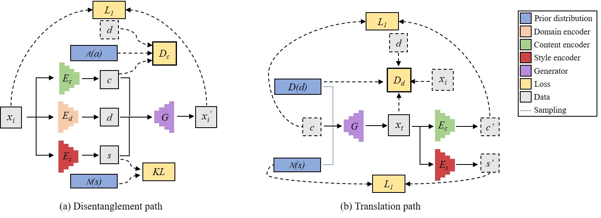
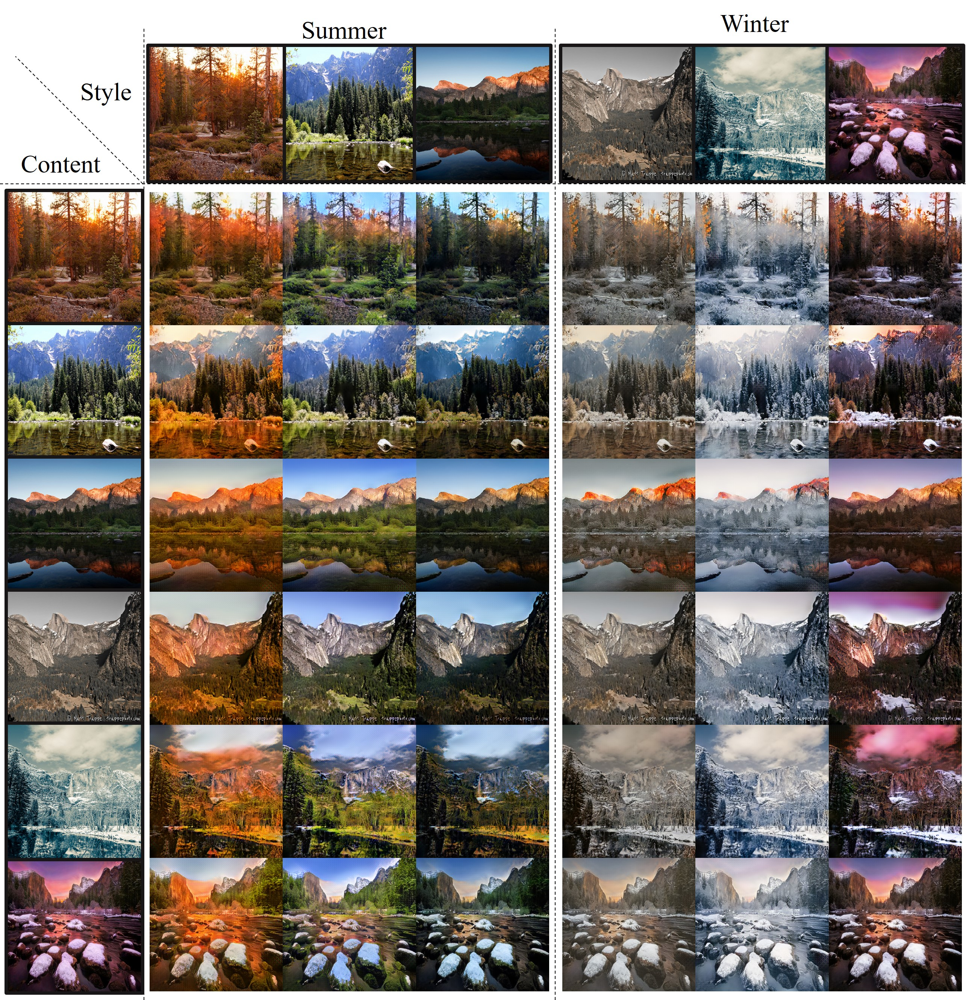
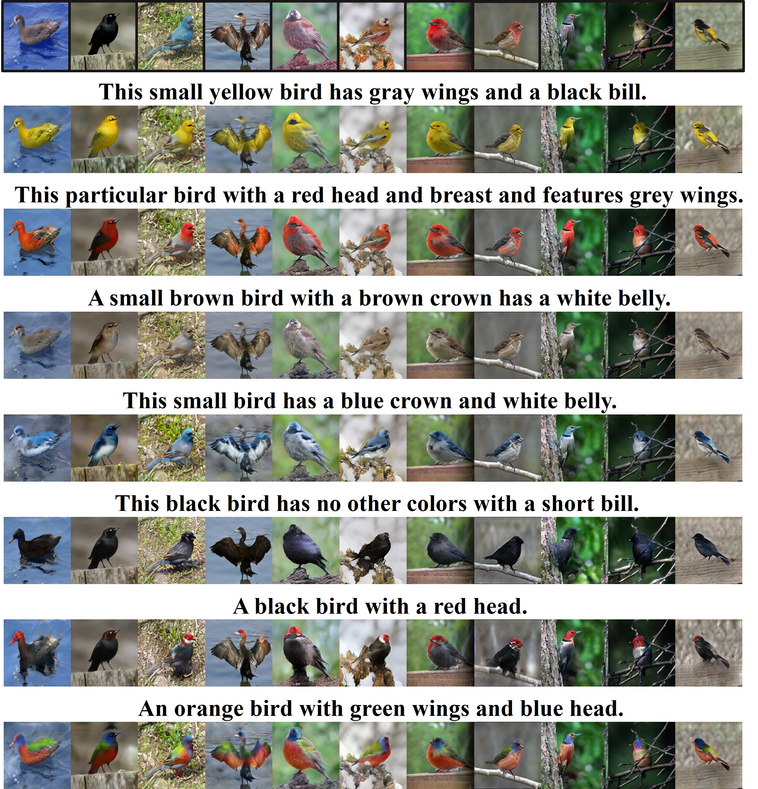

# DMIT

Pytorch implementation of our paper: ["Multi-mapping Image-to-Image Translation via Learning Disentanglement"](https://arxiv.org/abs/1909.07877).

<p align="center">

</p>

## Dependencies
you can install all the dependencies  by
```
pip install -r requirements.txt
```
 
## Getting Started

### Datasets
- Download and unzip preprocessed datasets by
	- Season Transfer 
		```
		bash ./scripts/download_datasets.sh summer2winter_yosemite
		```
	- Semantic Image Synthesis 
		```
		bash ./scripts/download_datasets.sh birds
		```

- Or you can manually download them from [CycleGAN](https://github.com/junyanz/CycleGAN) and [AttnGAN](https://github.com/taoxugit/AttnGAN).

### Training
- Season Transfer
	```
	bash ./scripts/train_season_transfer.sh
	```
- Semantic Image Synthesis 
	```
	bash ./scripts/train_semantic_image_synthesis.sh
	```
- To view training results and loss plots, run python -m visdom.server and click the URL http://localhost:8097. More intermediate results can be found in environment `exp_name`.

### Testing
- Run
	```
	bash ./scripts/test_season_transfer.sh
	bash ./scripts/test_semantic_image_synthesis.sh
	```
- The testing results will be saved in `checkpoints/{exp_name}/results` directory.

### Pretrained Models
Pretrained models can be downloaded from [Google Drive](https://drive.google.com/open?id=1SdF7ZpX0wzkl-UslU4hhZcaN7EbfnHr4) or [Baidu Wangpan](https://pan.baidu.com/s/1NUNdvGks928EWivqDoRF-w) with code `59tm`.

### Custom Experiment  
You can implement your [Dataset](https://github.com/Xiaoming-Yu/DMIT/blob/master/data/template_dataset.py) and [SubModel](https://github.com/Xiaoming-Yu/DMIT/blob/master/models/template_model.py) to start a new experiment.

### Results

#### Season Transfer: 
<p align="center">

</p>

#### Semantic Image Synthesis: 
<p align="center">

</p>

#### bibtex
If this work is useful for your research, please consider citing :
```
@inproceedings{yu2019multi,
  title={Multi-mapping Image-to-Image Translation via Learning Disentanglement},
  author={Yu, Xiaoming and Chen, Yuanqi and Liu, Shan and Li, Thomas and Li, Ge},
  booktitle={Advances in Neural Information Processing Systems},
  year={2019}
}
 ```
### Acknowledgement
The code used in this research is inspired by [BicycleGAN](https://github.com/junyanz/BicycleGAN), [MUNIT](https://github.com/NVlabs/MUNIT), [DRIT](https://github.com/HsinYingLee/DRIT), [AttnGAN](https://github.com/taoxugit/AttnGAN), and [SingleGAN](https://github.com/Xiaoming-Yu/SingleGAN).

The diversity regulazation used in the current version is inspired by [DSGAN](https://github.com/maga33/DSGAN) and [MSGAN](https://github.com/HelenMao/MSGAN).
### Contact
Feel free to reach me if there is any questions (xiaomingyu@pku.edu.cn).


